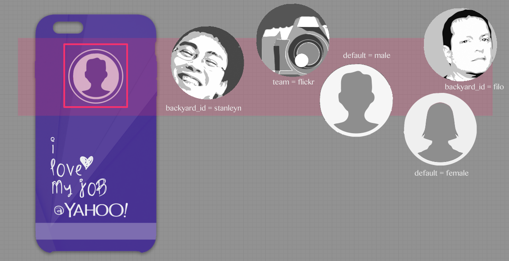
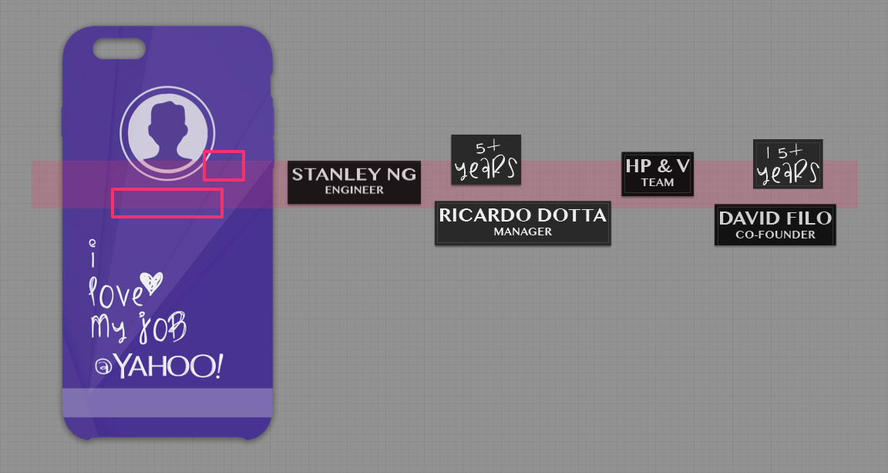
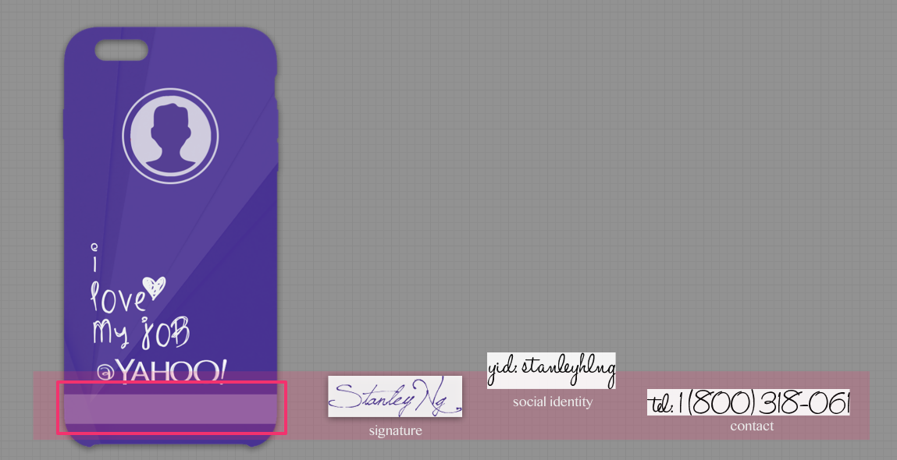

design-the-case
===============

Smart Phones, Smart Fun - Design the Case Competition

### The Competition

It is a design competition to design a phone case for the Apple iPhone and the Android phone.  The goal of this challenge is to "personalize" your phone case, makes it unique for everyone in Yahoo.

### Design Concept

In my design, people can customize the following elements in their phone case:

#### 1. `Avatar`

In `avatar` region, you can pick `your`/`founder`/`ceo`/`anonymous` photo, or `property`/`team` icon (e.g. `flickr`, `news`, ...).

#### 2. `Name & Years of Services`

In `name & years of services` region, you can put your `name`, `job title` and `years of services`.

#### 3. `Remark` for social id, e.g. `Twitter Id`, `Facebook Id`, ... or simpley `Handwritten Signature`

In `remark` region, you can select your `personal signature`, `mobile phone no.`, or `social network id`.

### Design Promo

To capture people's attention in my phone case design, I create 2 things to promote my work.

#### 1. Static Design Page

This is a static page to dump all my design concept in one page.  You can checkout the live demo [here](bit.ly/designthecase).

*walk through* the static design page

#### 2. Dynamic Design App 

To make it more fun and eye-catching, I have transformed my design concept into an iOS app.  You can checkout the project page [here](http://bit.ly/ios8_designthecase)

*walk through* the dynamic design app

❤
